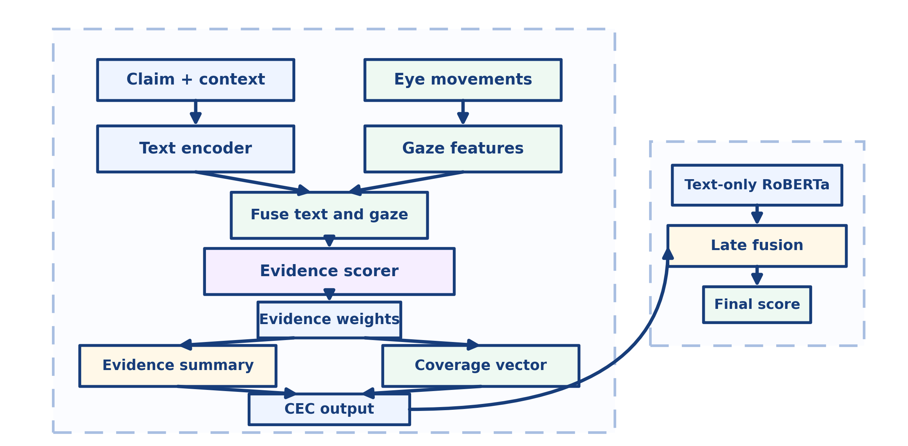
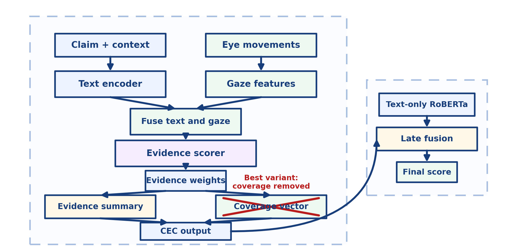
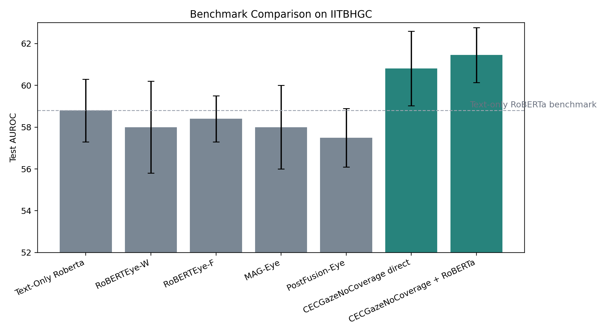
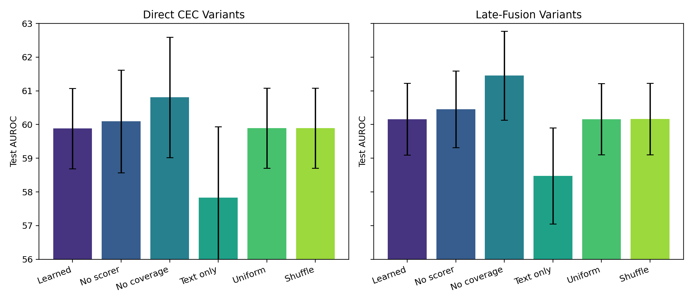
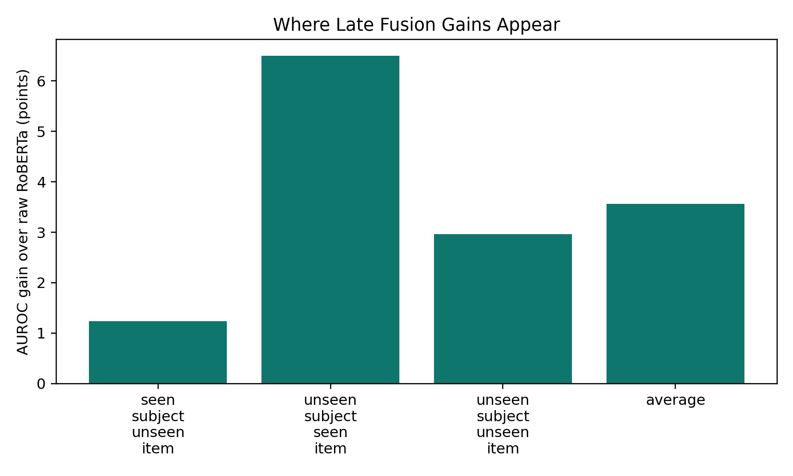
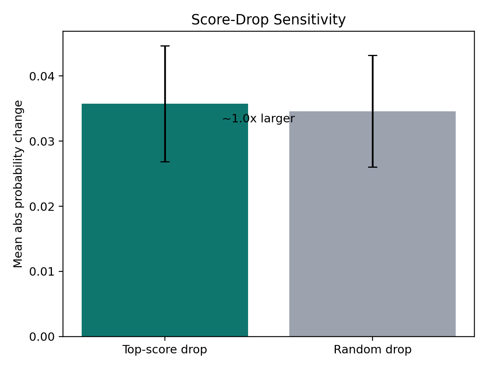

# Claim-Conditioned Evidence (CEC) Models for Eye-Tracked Claim Verification

## Abstract

We study IITB-HGC claim verification in EyeBench, where the task is to predict whether a reader will make the correct verification judgment from a claim, a context passage, and eye movements recorded during reading. We introduce a claim-conditioned evidence (CEC) model family that separates three ideas: claim-aware evidence selection, token-level gaze integration, and an optional pooled gaze coverage vector. We rerun the study with corrected claim/context handling, an exact Text-only RoBERTa benchmark reference, and a benchmark-parity sweep over learning rate, encoder freeze, and dropout. The strongest result comes from an ablated member of the CEC family rather than from the full original design: **CECGazeNoCoverage + RoBERTa** reaches **61.5 +/- 1.3** test AUROC, above the published EyeBench Text-only RoBERTa result of **58.8 +/- 1.5** and above all published IITBHGC multimodal baselines. Direct CEC is also competitive, with **CECGazeNoCoverage** reaching **60.8 +/- 1.8** test AUROC. The ablations make the scientific story clearer. Gaze-aware CEC variants help; the text-only CEC ablation does not. By contrast, the explicit coverage vector and the learned evidence scorer are not the components driving the gain: removing coverage helps most, and no-scorer / uniform / shuffle controls remain close to the learned model. The resulting contribution is still strong for a workshop paper: a benchmark-improving claim-verification architecture family, plus a transparent ablation study that shows what in the design helps and what does not.

## 1. Introduction

EyeBench evaluates whether eye movements improve downstream reading-related predictions. In IITB-HGC, the downstream target is whether a participant verifies a claim correctly after reading a supporting or refuting passage. This task is especially well matched to a structured multimodal model: a participant is not merely reading text, but searching a passage for claim-relevant evidence and deciding whether the claim is true or false.

Most EyeBench baselines do not model that structure explicitly. Text-only RoBERTa ignores gaze entirely. Existing multimodal baselines such as RoBERTEye, MAG-Eye, and PostFusion-Eye fuse text and gaze more generically. Our starting hypothesis was that a more task-matched model should reason about claim-conditioned evidence inside the passage and then ask whether the reader's gaze covers that evidence.

That idea led to the claim-conditioned evidence (CEC) model family. The original full version of CEC included an explicit pooled gaze coverage vector. After rerunning the corrected study and its ablations, however, the best-performing variant turns out to be the one that removes that extra branch while keeping claim-conditioned evidence weighting and token-level gaze fusion. The report therefore has two goals: to show that the CEC family improves the IITB-HGC benchmark, and to identify which parts of the family actually produce that gain.

## 2. Method

### 2.1 CEC architecture

The model receives a claim-context pair encoded as `[CLS] Claim [SEP] Context [SEP]` and processes it with a RoBERTa-Large encoder. For each token, we concatenate the contextual text representation with word-level gaze features and project the result into a fused token representation. A masked claim summary is computed over claim tokens.

CEC then applies a claim-conditioned evidence scorer over context tokens. Each context token receives a latent score from a small MLP that sees both its fused token state and the pooled claim representation. Softmax-normalized scores define an evidence distribution over the context. This distribution is used to build an evidence summary vector, which acts like a soft evidence selector. In the full model, the same distribution also weights gaze statistics such as dwell time, fixation count, regression activity, and skip behavior to produce a pooled coverage vector.

*Figure 1. Full CEC architecture. Claim-conditioned evidence weights are used both to summarize the fused token states and to build a pooled gaze coverage vector before classification and late fusion with Text-only RoBERTa.*

The best-performing variant in this study is **CECGazeNoCoverage**. It keeps the claim-conditioned scorer and token-level gaze fusion, but removes the pooled coverage-vector branch from the prediction pathway.

*Figure 2. Best-performing CEC variant. The explicit coverage vector is removed, while claim-conditioned evidence weighting and token-level gaze integration remain intact.*

### 2.2 Implementation and training protocol

Before running the study, we corrected several issues in the original implementation:

1. claim/context tokenization was fixed to preserve the intended paired-input structure;
2. claim/context masks were corrected so downstream modules receive the right segments;
3. the benchmark setting was aligned to RoBERTa-Large and 10 epochs;
4. the pipeline was updated to use the bundled exact Text-only RoBERTa IITB-HGC reference instead of an approximate local rerun.

For CEC, we use a benchmark-parity sweep over:

- learning rate: `{1e-5, 3e-5, 1e-4}`
- encoder freeze: `{True, False}`
- dropout: `{0.1, 0.3, 0.5}`

The winning full-CEC configuration is selected by validation average AUROC and then reused for the direct ablations (`NoCoverage`, `NoScorer`, and `TextOnly`). Late fusion selects a fold-local blending coefficient `alpha` on validation AUROC and applies it unchanged to test predictions.

## 3. Experimental Setup

We use the official IITB-HGC 4-fold EyeBench split with the three standard test regimes:

- unseen text (`seen_subject_unseen_item`)
- unseen reader (`unseen_subject_seen_item`)
- unseen reader and unseen text (`unseen_subject_unseen_item`)

Our official benchmark claims compare against the published EyeBench IITB-HGC test table. For matched bootstrap comparisons, we also use the bundled raw Text-only RoBERTa prediction reference under the same evaluator. Under this evaluator the raw reference aggregates to **57.9 +/- 2.1** AUROC, while the published benchmark table reports **58.8 +/- 1.5**. We therefore use the published table for the headline benchmark claim and the raw reference for paired resampling.

We report AUROC as the primary benchmark metric. Balanced accuracy is discussed only with validation-tuned thresholds, because the fused probabilities are not calibrated to a universal 0.5 operating point.

## 4. Results

### 4.1 Main benchmark result

The main result is that the strongest member of the CEC family, **CECGazeNoCoverage + RoBERTa**, is the best IITB-HGC system in this comparison.

| Model | Test AUROC | Notes |
|---|---:|---|
| Text-only RoBERTa (published EyeBench) | `58.8 +/- 1.5` | official benchmark reference |
| RoBERTEye-W (published EyeBench) | `58.0 +/- 2.2` | official multimodal baseline |
| RoBERTEye-F (published EyeBench) | `58.4 +/- 1.1` | official multimodal baseline |
| MAG-Eye (published EyeBench) | `58.0 +/- 2.0` | official multimodal baseline |
| PostFusion-Eye (published EyeBench) | `57.5 +/- 1.4` | official multimodal baseline |
| CECGaze direct | `59.9 +/- 1.2` | full learned CEC |
| CECGazeNoCoverage direct | `60.8 +/- 1.8` | best direct CEC variant |
| CECGaze + RoBERTa | `60.2 +/- 1.1` | full learned fusion |
| **CECGazeNoCoverage + RoBERTa** | **`61.5 +/- 1.3`** | **best overall result** |

*Figure 3. Published EyeBench baselines together with the best direct CEC variant and the best late-fusion CEC variant. The strongest model is `CECGazeNoCoverage + RoBERTa`.*

Two points matter here.

First, the benchmark improvement is real: the best fusion model improves on the published Text-only RoBERTa row by **+2.7 AUROC points** and on the published multimodal baselines by **+3.1 to +4.0 AUROC points**.

Second, even the best direct CEC variant is already competitive. `CECGazeNoCoverage` reaches **60.8 +/- 1.8** without relying on a separate external RoBERTa branch. That means the improvement is not only an ensemble trick; the CEC family itself is learning useful signal for IITB-HGC.

### 4.2 What the ablations say

The ablation results make the current story much clearer than before.

| Variant | Direct test AUROC | Late-fusion test AUROC | Interpretation |
|---|---:|---:|---|
| Learned full CEC | `59.9 +/- 1.2` | `60.2 +/- 1.1` | reference full model |
| No scorer | `60.1 +/- 1.5` | `60.5 +/- 1.1` | scorer is not essential |
| **No coverage** | **`60.8 +/- 1.8`** | **`61.5 +/- 1.3`** | best direct and fused variant |
| Text only | `57.8 +/- 2.1` | `58.5 +/- 1.4` | loses most of the gain |
| Uniform eval | `59.9 +/- 1.2` | `60.2 +/- 1.1` | effectively tied with learned |
| Shuffle eval | `59.9 +/- 1.2` | `60.2 +/- 1.1` | effectively tied with learned |

*Figure 4. Direct and late-fusion ablations. The strongest model is the no-coverage variant, while text-only CEC falls back toward the benchmark baseline.*

This table supports three findings.

1. **Token-level gaze integration matters.**  
   The text-only CEC ablation is clearly weaker than the gaze-aware variants. In late fusion, `CECGazeTextOnly + RoBERTa` reaches only **58.5 +/- 1.4**, which is essentially back at the published Text-only RoBERTa level rather than above it.

2. **The learned evidence scorer is not the main source of the benchmark gain.**  
   `NoScorer + RoBERTa` reaches **60.5 +/- 1.1**, and uniform/shuffle controls are nearly identical to the full learned fusion model. So the gain cannot currently be attributed to the learned score ordering itself.

3. **The explicit coverage vector hurts rather than helps.**  
   `NoCoverage` is the best variant both directly and in late fusion. The current evidence therefore argues for removing the pooled coverage branch from the main CEC model rather than defending it.

This is still a positive result. It means the useful ingredient is the claim-conditioned, gaze-aware CEC branch as a whole, especially its token-level gaze integration, not the specific pooled coverage summary.

### 4.3 Regime breakdown and paired bootstrap

The best model improves over the published Text-only RoBERTa benchmark in every test regime:

- unseen text: `56.3` vs `55.1` AUROC
- unseen reader: `69.0` vs `62.5` AUROC
- unseen reader and unseen text: `59.0` vs `56.1` AUROC

*Figure 5. Regime-wise AUROC gains of the best CEC fusion variant over the raw Text-only RoBERTa reference under a common evaluator.*

Under paired bootstrap against the bundled raw Text-only RoBERTa reference, the strongest model is decisively better:

| Comparison | Delta AUROC | 95% bootstrap CI | One-sided p |
|---|---:|---:|---:|
| **CECGazeNoCoverage + RoBERTa vs raw RoBERTa** | **`+3.57` points** | **`[+1.28, +5.78]`** | **`< 0.001`** |
| CECGaze + RoBERTa vs raw RoBERTa | `+2.27` points | `[+0.16, +4.51]` | `0.015` |
| CECGazeNoCoverage + RoBERTa vs CECGaze + RoBERTa | `+1.29` points | `[-0.13, +2.72]` | `0.040` |

The last comparison is especially useful. The no-coverage variant is not just numerically best; it also trends better than the full learned fusion model under paired resampling, even if that particular comparison is still borderline under a two-sided test.

### 4.4 What the evidence scorer does and does not show

The scorer diagnostics no longer support a strong "latent evidence explanation" story.

The old version of this report emphasized a large score-drop gap. With the corrected parity-sweep outputs, the learned full CEC model now shows only a small intervention difference:

- mean absolute probability change after top-score drop: **0.0371**
- mean absolute probability change after matched random drop: **0.0357**
- paired mean difference: **0.0014**
- bootstrap 95% CI: **[0.0009, 0.0019]**
- top/random ratio: **1.04x**
- fraction of trials where top-drop > random-drop: **54.1%**

*Figure 6. Score-drop sensitivity for the learned full CEC model. The top-score drop is only slightly more disruptive than matched random removal.*

Together with the near-ties between learned, uniform, and shuffle controls, this means we should not claim that the learned evidence scorer is the mechanism responsible for the benchmark improvement. The current evidence supports a narrower statement:

> the CEC branch adds useful gaze-aware signal, but the explicit score ordering and pooled coverage summary are not the parts of the design that currently explain the gain.

That is still a worthwhile scientific finding. It tells us what in the architecture family is carrying the result and what should be simplified.

## 5. Discussion

The updated results strengthen the workshop paper in one way and weaken it in another.

They strengthen it because the benchmark result is better than before. The best CEC variant now beats the published Text-only RoBERTa row and every published multimodal IITB-HGC baseline, and it does so with a coherent ablation story rather than a lucky single run. The direct model is also competitive on its own, which makes the family more interesting than a pure fusion trick.

They weaken it because the original mechanistic story does not survive intact. The learned scorer is not clearly better than no-scorer, and the explicit coverage vector is not helpful. But that is not fatal. In fact, it can make the paper stronger if we are honest about it. A workshop audience will often trust a paper more when it shows a real architectural idea, tests it seriously, and reports which parts worked and which parts did not.

The current strongest paper framing is therefore:

- **Model contribution:** a claim-conditioned, gaze-aware CEC architecture family for claim verification;
- **Empirical result:** the best CEC variant improves the IITB-HGC benchmark over all published EyeBench baselines;
- **Ablation result:** token-level gaze integration matters, while the pooled coverage vector and explicit learned scorer are not the winning ingredients in the current implementation.

That is still a real contribution. It is simply a more precise one than the first draft of the story.

## 6. Conclusion

We introduced a claim-conditioned evidence model family for eye-tracked claim verification, corrected its implementation, and reran it under benchmark-aligned conditions on IITB-HGC. The strongest result comes from **CECGazeNoCoverage + RoBERTa**, which reaches **61.5 +/- 1.3** test AUROC and outperforms the published EyeBench Text-only RoBERTa and multimodal baselines. The ablations make the mechanism clearer: gaze-aware CEC variants help, text-only CEC does not, the learned scorer is not currently essential, and the explicit coverage vector should be removed rather than promoted. That leaves us with a strong workshop contribution and a clear next step for the research line: treat CEC as a claim-conditioned gaze-aware model family, and build future versions around the parts that actually move the benchmark.
